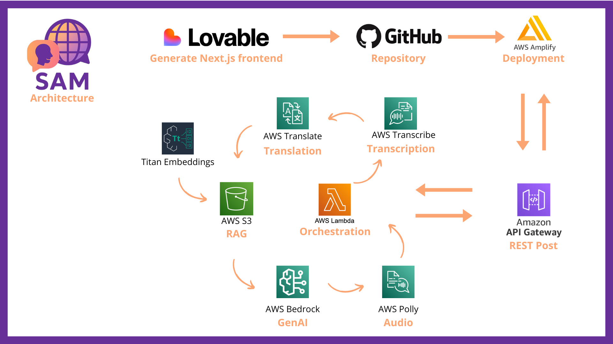

# 🧭 SAM – Smart Assistant for Migrants

**SAM** is a multilingual AI assistant designed to support humanitarian organizations in serving displaced people and migrants more efficiently.

This cloud-based web application allows users to ask questions (via text or voice) and receive answers powered by AWS services such as Transcribe, Translate, and Amazon Bedrock (Claude). NGOs access a dedicated dashboard for real-time insights, moderation, and multilingual co-conversations.

---

## 🌍 Mission

To empower NGOs with smart tools that:
- Break language and literacy barriers.
- Automate repetitive communication and reporting tasks.
- Surface insights from the field to inform better decisions.

---

## ✨ Features

- 🎤 **Voice-to-Text**: Users can speak in their native language – auto-transcribed and translated.
- 🧠 **AI-Powered Q&A**: Smart assistant answers contextual questions based on custom knowledge bases.
- 🌐 **Multilingual Interface**: Text and audio input/output in dozens of supported languages.
- 📊 **NGO Dashboard**: Monitor usage, moderate content, and identify trends across conversations.
- 🗂️ **Conversation Summaries**: Generate meeting notes and structured reports for internal use.
- 🔒 **Hosted on AWS**: Scalable, secure, and GDPR-compliant infrastructure.

## 👥 Team
- Louis – Product Owner
- Valentin - Tech Owner
- Aziz - Project Lead
- Martyna - Content and RAG Research Specialist
- Nganji - Conceptor & visionary
- Karen - Human Insight & Soul Systems Strategist
- Ali - Public Relations Manager 
- Ange - Backend lead

---

## 🤝 Contributing
Pull requests are welcome! For major changes, please open an issue first to discuss what you’d like to change. Let’s build something impactful together.

---

## 📄 License
MIT – Free to use for good causes. Please contact us for NGO deployments or partnerships.

---

## 🛠️ Tech Stack

- Frontend: Next.js (TypeScript, Tailwind CSS), AWS Amplify
- Backend: API Gateway, AWS Lambda 
- AI Services: Amazon Transcribe, Translate, Bedrock (Claude), RAG Faiss
- Storage: Amazon S3
- Auth: Supabase

---

## Lambda Function

    import json
    import base64
    import time
    import boto3
    import uuid
    import urllib.request
    
    s3 = boto3.client('s3')
    transcribe = boto3.client('transcribe')
    translate = boto3.client('translate')
    bedrock = boto3.client('bedrock-runtime', region_name='eu-north-1')
    
    
    BUCKET_NAME = 'sam-audio-input-eu'
    REGION = 'eu-north-1'
    
    TRANSCRIBE_LANG_MAP = {
        'ab': 'ab-GE',
        'af': 'af-ZA',
        'ar': 'ar-SA',
        'ar-ae': 'ar-AE',
        'ast': 'ast-ES',
        'az': 'az-AZ',
        'ba': 'ba-RU',
        'be': 'be-BY',
        'bg': 'bg-BG',
        'bn': 'bn-IN',
        'bs': 'bs-BA',
        'ca': 'ca-ES',
        'ckb': 'ckb-IQ',  # Kurdish, fallback on Iraq
        'cs': 'cs-CZ',
        'cy': 'cy-WL',
        'da': 'da-DK',
        'de': 'de-DE',
        'de-ch': 'de-CH',
        'el': 'el-GR',
        'en': 'en-US',
        'en-au': 'en-AU',
        'en-gb': 'en-GB',
        'en-in': 'en-IN',
        'en-ie': 'en-IE',
        'en-nz': 'en-NZ',
        'en-ab': 'en-AB',
        'en-za': 'en-ZA',
        'en-wl': 'en-WL',
        'es': 'es-ES',
        'es-us': 'es-US',
        'et': 'et-ET',
        'eu': 'eu-ES',
        'fa': 'fa-IR',
        'fi': 'fi-FI',
        'fr': 'fr-FR',
        'fr-ca': 'fr-CA',
        'gl': 'gl-ES',
        'gu': 'gu-IN',
        'ha': 'ha-NG',
        'he': 'he-IL',
        'hi': 'hi-IN',
        'hr': 'hr-HR',
        'hu': 'hu-HU',
        'hy': 'hy-AM',
        'id': 'id-ID',
        'is': 'is-IS',
        'it': 'it-IT',
        'ja': 'ja-JP',
        'kab': 'kab-DZ',
        'ka': 'ka-GE',
        'kk': 'kk-KZ',
        'kn': 'kn-IN',
        'ko': 'ko-KR',
        'ky': 'ky-KG',
        'lg': 'lg-IN',
        'lt': 'lt-LT',
        'lv': 'lv-LV',
        'mk': 'mk-MK',
        'ml': 'ml-IN',
        'mn': 'mn-MN',
        'mhr': 'mhr-RU',
        'mr': 'mr-IN',
        'ms': 'ms-MY',
        'mt': 'mt-MT',
        'nb': 'no-NO',  
        'nl': 'nl-NL',
        'or': 'or-IN',
        'pa': 'pa-IN',
        'pl': 'pl-PL',
        'ps': 'ps-AF',
        'pt': 'pt-PT',
        'pt-br': 'pt-BR',
        'ro': 'ro-RO',
        'ru': 'ru-RU',
        'rw': 'rw-RW',
        'si': 'si-LK',
        'sk': 'sk-SK',
        'sl': 'sl-SI',
        'so': 'so-SO',
        'sr': 'sr-RS',
        'su': 'su-ID',
        'sv': 'sv-SE',
        'sw': 'sw-KE', 
        'sw-bi': 'sw-BI',
        'sw-rw': 'sw-RW',
        'sw-tz': 'sw-TZ',
        'sw-ug': 'sw-UG',
        'ta': 'ta-IN',
        'te': 'te-IN',
        'th': 'th-TH',
        'tl': 'tl-PH',
        'tr': 'tr-TR',
        'tt': 'tt-RU',
        'ug': 'ug-CN',
        'uk': 'uk-UA',
        'ur': 'ur-IN',
        'uz': 'uz-UZ',
        'vi': 'vi-VN',
        'wo': 'wo-SN',
        'yue': 'yue-HK',
        'zh': 'zh-CN',
        'zh-hk': 'zh-HK',
        'zh-tw': 'zh-TW',
        'zu': 'zu-ZA'
    }
    TRANSLATE_LANG_MAP = {
                'pt-br': 'pt',
                'pt-pt': 'pt',
                'zh-cn': 'zh',
                'zh-hk': 'zh',
                'zh-tw': 'zh-TW',
                'fr-ca': 'fr',
                'en-us': 'en',
                'en-gb': 'en',
                'sw-ke': 'sw',
                'sw-bi': 'sw',
                'sw-ug': 'sw',
                'kab': 'fr',  # fallback to French if Translate unsupported
                'ckb': 'ar',  # fallback to Arabic
                # ajoute selon les besoins
            }

        

    def lambda_handler(event, context):
        print("Received event:", json.dumps(event))

    try:
        body = json.loads(event['body']) if isinstance(event['body'], str) else event['body']
        print("Parsed body:", body)

        audio_base64 = body.get('file_base64')
        source_lang = body.get("language", "fr").lower().strip()

        if not audio_base64:
            return response_with_headers(400, {'message': 'Missing audio file in base64'})

        transcribe_lang_code = TRANSCRIBE_LANG_MAP.get(source_lang)
        if not transcribe_lang_code:
            return response_with_headers(400, {'message': f"Language '{source_lang}' not supported for transcription"})

        # 1. Decode and upload to S3
        try:
            audio_bytes = base64.b64decode(audio_base64)
            filename = f"audio-{uuid.uuid4()}.mp3"
            s3.put_object(Bucket=BUCKET_NAME, Key=filename, Body=audio_bytes)
            media_uri = f's3://{BUCKET_NAME}/{filename}'
            print(f"Uploaded to S3: {media_uri}")
        except Exception as e:
            print("Upload error:", str(e))
            return response_with_headers(500, {'message': 'Failed to upload to S3', 'error': str(e)})

        # 2. Start transcription
        job_name = f"transcribe-job-{uuid.uuid4()}"
        try:
            transcribe.start_transcription_job(
                TranscriptionJobName=job_name,
                Media={'MediaFileUri': media_uri},
                MediaFormat='mp3',
                LanguageCode=transcribe_lang_code
            )
            print(f"Transcription job started: {job_name}")
        except Exception as e:
            print("Transcription start error:", str(e))
            return response_with_headers(500, {'message': 'Failed to start transcription', 'error': str(e)})

        # 3. Wait for transcription to complete
        try:
            start_time = time.time()
            while True:
                status = transcribe.get_transcription_job(TranscriptionJobName=job_name)
                job_status = status['TranscriptionJob']['TranscriptionJobStatus']
                print("Transcription status:", job_status)
                if job_status in ['COMPLETED', 'FAILED']:
                    break
                if time.time() - start_time > 25:
                    raise TimeoutError("Transcription timed out")
                time.sleep(2)

            if job_status == 'FAILED':
                return response_with_headers(500, {'message': 'Transcription job failed'})
        except Exception as e:
            print("Polling error:", str(e))
            return response_with_headers(500, {'message': 'Failed to poll transcription', 'error': str(e)})

        # 4. Retrieve and translate transcription
        # Convert Transcribe codes to Translate-compatible codes
        
        source_lang_for_translate = TRANSLATE_LANG_MAP.get(source_lang, source_lang)
        try:
            transcript_url = status['TranscriptionJob']['Transcript']['TranscriptFileUri']
            response = urllib.request.urlopen(transcript_url)
            transcript_json = json.loads(response.read())
            transcribed_text = transcript_json['results']['transcripts'][0]['transcript']
            print("Transcript:", transcribed_text)
        except Exception as e:
            print("Transcript retrieval error:", str(e))
            return response_with_headers(500, {'message': 'Failed to retrieve transcript', 'error': str(e)})

        # 5. Translate to English
        try:
            if not transcribed_text.strip():
                return response_with_headers(400, {
                    'message': 'La transcription est vide. Veuillez réessayer avec un enregistrement plus clair ou plus long.'
                })

            translation = translate.translate_text(
                Text=transcribed_text,
                SourceLanguageCode=source_lang_for_translate,
                TargetLanguageCode='en'
            )
            translated_text = translation['TranslatedText']
            print("Translated text:", translated_text)
        except Exception as e:
            print("Translation error:", str(e))
            return response_with_headers(500, {'message': 'Failed to translate', 'error': str(e)})
        
        prompt_claude = f"""
        You are an assistant specialized in humanitarian aid and asylum procedures.
        
        A person has just said (translated into English):
        \"{translated_text}\"
        
        Please provide a helpful, empathetic, and concise response. Keep it clear and action-oriented, suitable for someone in distress who may have limited understanding of legal processes.
        """

        try:
            response_claude = bedrock.invoke_model(
                modelId="eu.anthropic.claude-3-7-sonnet-20250219-v1:0",
                contentType="application/json",
                accept="application/json",
                body=json.dumps({
                    "anthropic_version": "bedrock-2023-05-31",
                    "max_tokens": 500,
                    "temperature": 0.7,
                    "messages": [
                        {
                            "role": "user",
                            "content": [
                                {
                                    "type": "text",
                                    "text": prompt_claude.strip()
                                }
                            ]
                        }
                    ]
                })  # <-- ici le json.dumps est crucial
            )

            response_body = json.loads(response_claude['body'].read())
            claude_reply = response_body['content'][0]['text']

            print("Claude reply:", claude_reply)

            return response_with_headers(200, {
                'message': claude_reply,
                'transcript': transcribed_text,
            })

        except Exception as e:
            print("Claude invocation error:", str(e))
            return response_with_headers(500, {'message': 'Failed to get Claude response', 'error': str(e)})

    except Exception as e:
        print("General error:", str(e))
        return response_with_headers(500, {'message': 'Internal server error', 'error': str(e)})

    def response_with_headers(status_code, body):
        return {
            'statusCode': status_code,
            'headers': {
                'Access-Control-Allow-Origin': '*',
                'Access-Control-Allow-Headers': 'Content-Type,X-Amz-Date,Authorization,X-Api-Key,X-Amz-Security-Token',
                'Access-Control-Allow-Methods': 'POST,OPTIONS'
            },
            'body': json.dumps(body)
        }
´´´
Lambda Polly
´´´
        import json
        import boto3
        import uuid
        
      s3 = boto3.client('s3')
      polly = boto3.client('polly')
      
      BUCKET_NAME = 'sam-polly'
      REGION = 'eu-north-1'
      
      # Mappe les langues simples à des VoiceId Polly
      LANG_TO_VOICE_ID = {
          'en': 'Joanna',
          'fr': 'Celine',
          'de': 'Marlene',
          'es': 'Lucia',
          'it': 'Carla',
          'pt': 'Ines',
          'hi': 'Aditi',
          'ja': 'Mizuki',
          'ko': 'Seoyeon',
          'zh': 'Zhiyu',
          'ar': 'Zeina'
      }
      
      def lambda_handler(event, context):
          print("Received event:", json.dumps(event))
    
        try:
            body = json.loads(event['body']) if isinstance(event['body'], str) else event['body']
            message = body.get('message')
            lang = body.get('lang', 'en').lower()
    
            if not message:
                return response_with_headers(400, {'message': 'Missing "message" in request body.'})
    
            voice_id = LANG_TO_VOICE_ID.get(lang, 'Joanna')  # fallback to English
    
            # Synthèse vocale
            response = polly.synthesize_speech(
                Text=message,
                OutputFormat='mp3',
                VoiceId=voice_id
            )
    
            # Génère un nom unique
            filename = f"tts-{uuid.uuid4()}.mp3"
            s3.put_object(
                Bucket=BUCKET_NAME,
                Key=filename,
                Body=response['AudioStream'].read(),
                ContentType='audio/mpeg'
            )
    
            file_url = f"https://{BUCKET_NAME}.s3.{REGION}.amazonaws.com/{filename}"
            print("Generated audio file at:", file_url)
    
            return response_with_headers(200, {
                'audio_url': file_url
            })
    
        except Exception as e:
            print("Error:", str(e))
            return response_with_headers(500, {'message': 'Internal server error', 'error': str(e)})
    
    
    def response_with_headers(status_code, body):
        return {
            'statusCode': status_code,
            'headers': {
                'Access-Control-Allow-Origin': '*',
                'Access-Control-Allow-Headers': '*',
                'Access-Control-Allow-Methods': 'POST,OPTIONS'
            },
            'body': json.dumps(body)
        }
´´´

## 🚀 This is a project for AWS: Breaking Barriers Hackathon

https://aws.amazon.com/fr/telecom/breaking-barriers/
